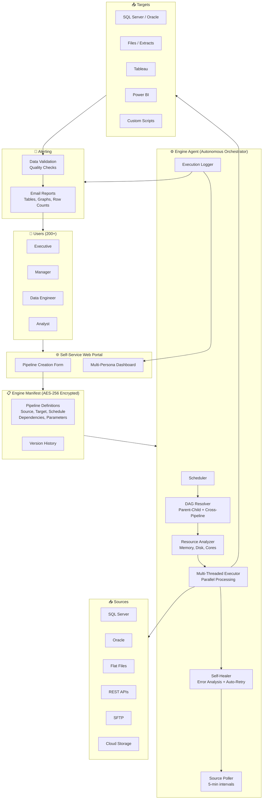
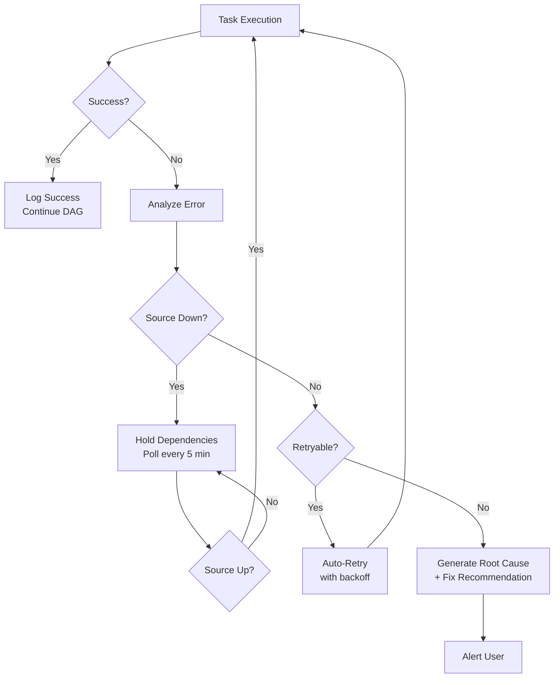
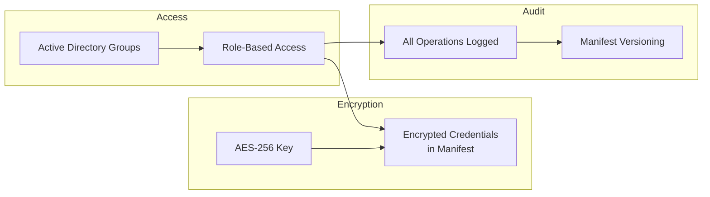
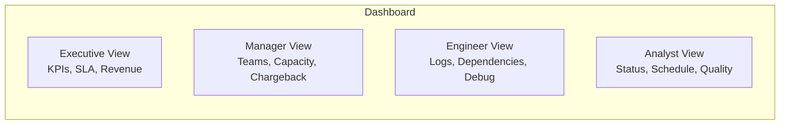

# FlowEngine — Architecture Diagram

## System Overview



## Data Flow

```mermaid
flowchart LR
    subgraph Input
        A[User enters:<br/>Source + Target + Schedule]
    end

    subgraph Engine["Engine Agent Processing"]
        B[Read Manifest]
        C[Resolve Dependencies]
        D[Check Resources]
        E[Execute in Parallel]
        F[Transform Data]
        G[Stream to Target]
    end

    subgraph Output
        H[Write Target]
        I[Summarize Data]
        J[Generate Extracts]
        K[Refresh Dashboards]
        L[Send Notifications]
    end

    A --> B --> C --> D --> E --> F --> G --> H --> I --> J --> K --> L
```



## Self-Healing Flow



## Security Model



## Multi-Persona Dashboard



## Infrastructure

```
┌─────────────────────────────────────┐
│ Single Server: 4 Cores, 16 GB RAM   │
│                                      │
│ ┌──────────────────────────────┐    │
│ │ Engine Agent (PowerShell)     │    │
│ │ 6,000+ lines                  │    │
│ │ Multi-threaded execution      │    │
│ │ DAG resolver                  │    │
│ │ Resource manager              │    │
│ └──────────────────────────────┘    │
│                                      │
│ ┌──────────────────────────────┐    │
│ │ SQL Server                    │    │
│ │ Engine Manifest (versioned)   │    │
│ │ Execution logs                │    │
│ │ Audit trail                   │    │
│ └──────────────────────────────┘    │
│                                      │
│ ┌──────────────────────────────┐    │
│ │ IIS / Web Portal              │    │
│ │ ASP.NET Web Forms             │    │
│ │ Multi-persona dashboard       │    │
│ └──────────────────────────────┘    │
│                                      │
│ Results:                             │
│ • 1,500+ jobs                        │
│ • 1.5M+ task runs in 6 months       │
│ • 2B+ rows processed in 2 hours     │
│ • 99.9999% resiliency               │
└─────────────────────────────────────┘
```
